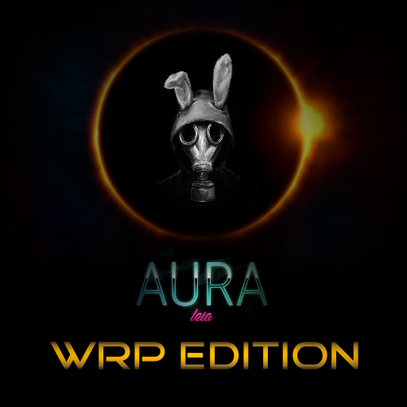
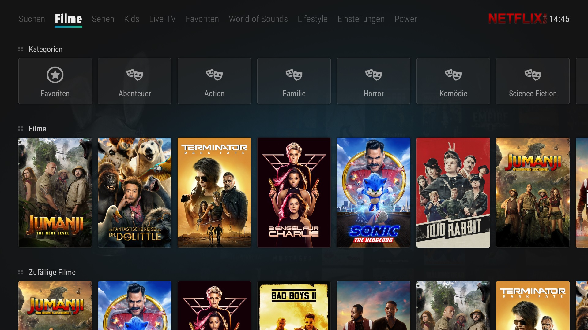

# Skin Aura WRP Mod Kodi Add-on

***

Der Skin Aura WRP Mod ist eine anpassbare Skin Oberfläche mit mehreren Widgets und einem horizontalen Startmenü. Der Aura WRP Mod kombiniert den Minimalismus und die abgerundeten Kanten von Arctic Zephyr mit der schlanken Anpassbarkeit von Horizon. Während das beste Aura WRP Mod-Erlebnis mit einer Fernbedienung erzielt wird, wurde Aura WRP Mod entwickelt, um Maus- und Touch-Benutzer nach Möglichkeit unterzubringen.

***
 Hier findet ihr Hilfe wenn es um WRP-Addons geht.

***

Original Source Code Forked from Aura Skin
